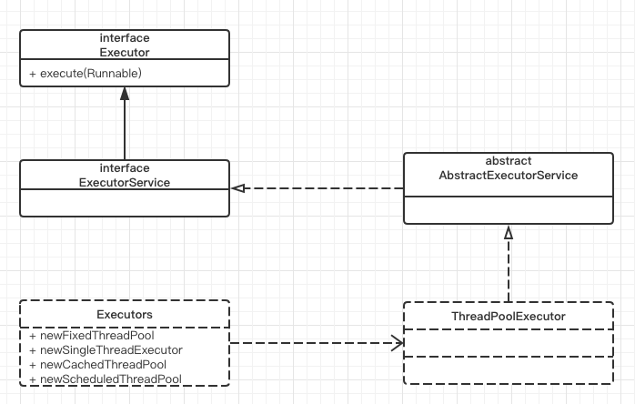

# thread-concurrency-java
## 并发工具类
thread-concurrency-java
semaphore
countDownLatch
cyclicBarrier

## Timer

## lock
### 重入锁 ReentrantLock
在开始讲解线程池之前, 我们需要了解重入锁, 这里只是简单说明, 需要深入了解的同学可以找资料研究.
所谓重入锁, 是指一个线程可以对同一个资源重复加锁, 为什么要这样定义? 
因为比如方法 1 用了锁, 方法 2 也用了锁, 当方法 1 调用方法 2 时, 如果不允许重入锁, 那么就造成死锁了, 
所以才需要锁能重入. 当然加多少次锁就要释放多少次锁. 为了保证一定能释放锁, 释放锁的操作一定要放到 finally 块中.

ReentrantLock 实现的原理是 AbstractQueuedSynchronizer, 队列同步器, 简称 AQS, 基础也是基于 CAS 算法.
ReentrantLock 用 state 表示是否加锁, 0 表示没有锁, 当前线程可以持有锁, 1 表示有其他线程持有锁, 那么需要把当前线程加入到同步队列等待(这里实际是用双向链表表示队列).
重复加锁会让 state 加一, 至于这里对 state 变量操作, 当然是用 CAS 算法操作, 这样才能保证只有一个线程可以修改成功, 也就只有一个线程可以持有锁.

## threadPool
线程池的作用：线程池作用就是限制系统中执行线程的数量。
根据系统的环境情况，可以自动或手动设置线程数量，达到运行的最佳效果；
少了浪费了系统资源，多了造成系统拥挤效率不高。用线程池控制线程数量，其他线程排 队等候。一个任务执行完毕，再从队列的中取最前面的任务开始执行。
若队列中没有等待进程，线程池的这一资源处于等待。当一个新任务需要运行时，如果线程池 中有等待的工作线程，就可以开始运行了；否则进入等待队列。

为什么要用线程池:
1.减少了创建和销毁线程的次数，每个工作线程都可以被重复利用，可执行多个任务。
2.可以根据系统的承受能力，调整线程池中工作线线程的数目，防止因为消耗过多的内存，而把服务器累趴下(每个线程需要大约1MB内存，线程开的越多，消耗的内存也就越大，最后死机)。

Java里面线程池的顶级接口是Executor，但是严格意义上讲Executor并不是一个线程池，而只是一个执行线程的工具。
真正的线程池接口是ExecutorService。
比较重要的几个类：
1. Executor:是一个最基本的接口，只有一个execute方法。
2. ExecutorService:继承Executor，提供了一些管理任务的方法，真正的线程池接口。
3. AbstractExecutorService:是一个实现ExecutorService的抽象类
4. ScheduledExecutorService:能和Timer/TimerTask类似，解决那些需要任务重复执行的问题。
5. ThreadPoolExecutor:继承AbstractExecutorService,ExecutorService的默认实现,是整个线程池体系的核心类。
6. ScheduledThreadPoolExecutor:继承ThreadPoolExecutor的ScheduledExecutorService接口实现，周期性任务调度的类实现。
7. Executors:是一个工厂类，提供一些静态方法返回不同类型的Executor，实现依赖ThreadPoolExecutor，说得更详细一点就是他就是return不同构造参数的ThreadPoolExecutor来实现各种线程池，不建议直接用Executors。

### threadPool
1. newSingleThreadExecutor
创建一个单线程的线程池。这个线程池只有一个线程在工作，也就是相当于单线程串行执行所有任务。如果这个唯一的线程因为异常结束，那么会有一个新的线程来替代它。此线程池保证所有任务的执行顺序按照任务的提交顺序执行。

2.newFixedThreadPool
创建固定大小的线程池。每次提交一个任务就创建一个线程，直到线程达到线程池的最大大小。线程池的大小一旦达到最大值就会保持不变，如果某个线程因为执行异常而结束，那么线程池会补充一个新线程。

3. newCachedThreadPool
创建一个可缓存的线程池。如果线程池的大小超过了处理任务所需要的线程，
那么就会回收部分空闲（60秒不执行任务）的线程，当任务数增加时，此线程池又可以智能的添加新线程来处理任务。此线程池不会对线程池大小做限制，线程池大小完全依赖于操作系统（或者说JVM）能够创建的最大线程大小。

4.newScheduledThreadPool
创建一个大小无限的线程池。此线程池支持定时以及周期性执行任务的需求。

### threadPool的execute&submit
总结execute()和submit()方法的区别：
1. 接收的参数不一样;
2. submit()有返回值，而execute()没有;
例如，有个validation的task，希望该task执行完后告诉我它的执行结果，是成功还是失败，然后继续下面的操作。
3. submit()可以进行Exception处理;