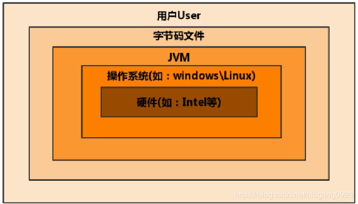

# Java 内存管理

## 相关概念
1. 冯·诺伊曼计算机体系
2. CPU指令
3. CPU三级缓存
4. 内存屏障
5. 多核CPU之间可见性 
6. Java虚拟机内存结构(JVM-Java Virtual Machine)
7. Java内存模型(JMM-Java Memory Model)
7. 类加载器
8. 指令重排序

    jvm 运行时内存结构 java虚拟机运行时数据区域有关
    java 内存模型 java并发编程有关，共享内存的可见性、原子性、有序性。
    java 对象模型 java对象的存储结构，不同对象存储在不同数据区，方法区、堆、栈。

> [Java虚拟机内存结构](https://segmentfault.com/a/1190000020206676?utm_source=tag-newest)
> [Java虚拟机内存结构](https://blog.csdn.net/qq_36907589/article/details/80839385)

### 1 Java虚拟机内存结构
堆、栈、方法
Java虚拟机是Java平台的基石。它是技术的组成部分，负责硬件和操作系统的独立性，编译代码的小巧大小以及保护用户免受恶意程序侵害的能力。
Java虚拟机是抽象的计算机。像真正的计算机一样，它具有指令集并在运行时操作各种内存区域。使用虚拟机实现编程语言是相当普遍的。

JVM位置：

> [The Java Virtual Machine](https://docs.oracle.com/javase/specs/jvms/se8/html/jvms-1.html#jvms-1.2)
> [Java虚拟机内存结构](https://www.cnblogs.com/aflyun/p/10575740.html)
> [Java虚拟机内存结构](https://www.jianshu.com/p/bf158fbb2432)
> [Java虚拟机内存结构](https://www.jianshu.com/p/76959115d486)
### 2 Java内存模型
保证多线程之间操作共享变量的正确性

> [Java内存模型](https://www.jianshu.com/p/bf158fbb2432)

### 3 CPU缓存
CPU L1|--总线--|L2 L3|内存 三级缓存
### 4 CPU指令
通常一条指令包括两方面的内容：操作码和操作数，操作码决定要完成的操作，操作数指参加运算的数据及其所在的单元地址。
操作要求和操作数地址都由二进制数码表示，分别称作操作码和地址码，整条指令以二进制编码的形式存放在存储器中。
### 5 可见性
可见性存在与多核CPU的情况下，所以，也可以说是多核CPU之间的数据可见性；
强内存模型:相同地址都各个CPU能看到；
弱内存模型:不同CPU之间存在内存屏障(memory barriers),需要通过执行指令将缓存中数据同步至内存中其它CPU才能看到；

实现可见性:
1.刷新CPU缓存的数据到内存中，保证这个写操作能够被其它CPU可见;
2.将CPU缓存的数据设置为无效状态，保证其它CPU的写操作对本CPU可见。
> 内存屏障，除了实现CPU之前的数据可见性之外，还有一个重要的职责，可以禁止指令的重排序。
### 6 指令重排序
这里说的重排序可以发生在好几个地方：编译器、运行时、JIT等，比如编译器会觉得把一个变量的写操作放在最后会更有效率，
编译后，这个指令就在最后了（前提是只要不改变程序的语义，编译器、执行器就可以这样自由的随意优化），
一旦编译器对某个变量的写操作进行优化（放到最后），那么在执行之前，另一个线程将不会看到这个执行结果。

## synchronized
1)互斥功能
2)对于后续进入该代码块的线程是可见的（又是可见性，不过这里需要注意是对同一个monitor对象而言）
3)它还有一个语义是禁止指令的重排序，对于编译器来说，同步块中的代码不会移动到获取和释放monitor外面

## final
1)final修饰字段，可保证可见性
2)final修饰字段，禁止指令重排序

> 在对象的构造过程中，不允许对该对象进行引用，不然的话，可能存在其它线程在对象还没构造完成时就对该对象进行访问。
## volatile
1)volatile修饰字段，每次写操作后，都会同步至内存中，可保证可见性
2)volatile修饰字段处代码被禁止重排序

可见性，对于一个该变量的读，一定能看到读之前最后的写入。
防止指令重排序，执行代码时,为了提高执行效率,会在不影响最后结果的前提下对指令进行重新排序,使用volatile可以防止；

## 附录

### CPU如何工作
CPU具有以下4个方面的基本功能：数据通信，资源共享，分布式处理，提供系统可靠性。
运作原理可基本分为四个阶段：提取（Fetch）、解码（Decode）、执行（Execute）和写回（Writeback）。

### 常量池
>jvm常量池也是对象池，它和在堆中du的存储没有区别（底层存储都zhi是一样的，dao只是对象之间的引用有差别）。
>那为什么要有常量池呢？因为它可以节省时间和空间，当需要一个对象的时候，可以直接从常量池中获取，而不需要重新创建，这样也就节省了时间和空间（常量池判断对象是否存在应该是equals方法）。
 除了String外，Java的8种基本类型(Byte, Short, Integer, Long, Character, Boolean, Float, Double)除Float和Double以外，其它六种都实现了常量池。

### 程序计数器
程序计数器是计算机处理器中的寄存器，它包含当前正在执行的指令的地址（位置）。
JVM中的程序计数器（Program Counter Register）中，Register的命名源于CPU的寄存器，寄存器存储指令相关的现场信息。
CPU只有把数据装载到寄存器才能运行。
这里，并非广义上所指的物理寄存器，获取将其翻译为PC寄存器(或指令计数器)会更加贴切(也称为程序钩子)，并且也不容器引起一些不必要的误会。
JVM中的PC寄存器是对物理PC寄存器的一种抽象模拟。

> [程序计数器](https://www.cnblogs.com/niugang0920/p/12424671.html)

### 指令集架构
1.IR-Instruction Register
指令寄存器是用来存放du指令的，存放当前正在执行的指zhi令，包括指令的操作码，地址码，地址信息
2.PC-Program Counter
程序计数器，是用来计数的，指示指令在存储器的存放位置，也就是个地址信息

Java编译器输入的指令流基本是一种基于栈的指令集架构(PC)，另外一种指令集架构则是基于寄存器的指令集架构(IR)。
HotSpot VM 寄存器就是PC寄存器;
由于跨平台性的设计，Java的指令都是根据栈设计的。不用平台CPU架构不同，所以不能设计为基于寄存器的。
有点是跨平台，指令集小，编译器容器实现，缺点是性能降低(比寄存器)，实现同样的功能需要更多的指令。
> [指令寄存器](https://www.cnblogs.com/snow-man/p/10617230.html)

### JVM
Oracle 现在有两个JVM 
BEA：JRockit VM 最快的JVM   
SUN：HotSpot VM

Java8开始整合了两个JVM，取出老年代，新增元空间(Metaspace)；

### JVM 后台线程

