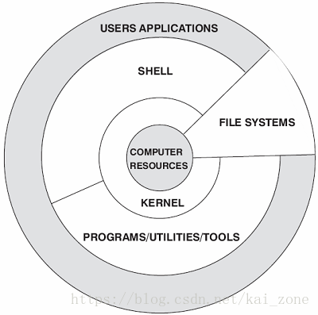
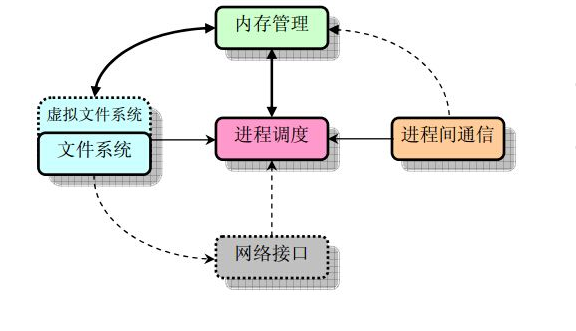
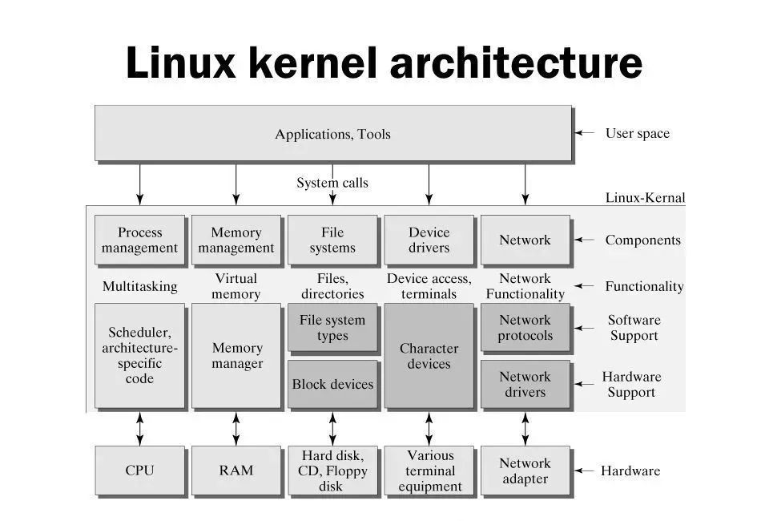
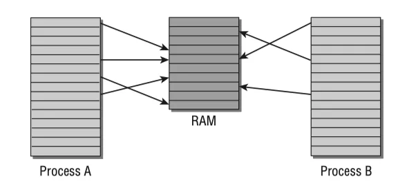
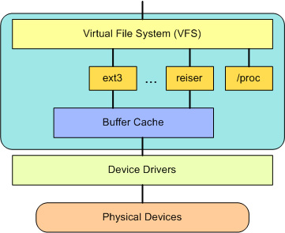

# Linux 

## 1 Linux 系统架构
从宏观看,linux体系结构分为:
1.用户空间:C库、用户应用程序
2.内核空间:系统调用接口、内核、硬件平台依赖代码

user space(用户空间)
-------------------
system call interface(SCI系统调用) 
-------------------  
kernel space(内核空间)
-------------------

具体一些,分为:
1.应用程序:
2.C库:
3.shell:
4.系统调用:
5.内核:
6.硬件:
  

## 2 Linux 内核
Linux内核组成:内存管理、进程管理、设备驱动程序、文件系统和网络管理等;  
  

  

主要了解Linux的进程调度、内存管理、设备驱动、文件系统、网络模块。
> [下载内核网址](https://www.kernel.org/)
> [内核](https://www.sohu.com/a/343114265_187948)
> [内核](https://www.ibm.com/developerworks/cn/linux/l-system-calls/index.html)

## 3 Linux 内存管理
为了使有限的物理内存满足应用程序对内存的需求,linux采用"虚拟内存"的内存管理方式实现;
先给应用程序分配虚拟内存,通过操作系统在硬件设备寻址,找到对应的物理内存单元,然后对其操作;
当物理内存不够用时,使用交换分页来将使用较少的空间存储在硬盘上;

### 3.1 寻址
CPU的字节长度决定了最大的可寻址空间,32位机器最大寻址空间是4GBytes,64位机器最大寻址空间是2^64Bytes。
最大寻址空间和物理内存大小无关,称之为虚拟地址空间,Linux内核把虚拟地址空间分为内核空间和用户空间。
每个用户进程的虚拟地址空间范围是0~TASK_SIZE。
从TASK_SIZE~2^32或2^64的区域保留给内核,不能被用户进程访问。

### 3.2 交换空间
换出：物理内存---->交换空间
换入：交换空间---->物理内存
1、内核将程序运行用到的页面就放到内存里,暂时不用就放到交换空间中(换出)。
2、当用到交换空间的页面时,就把它们调到内存中(换入),然后把物理内存其他用不到的页面换出到交换空间。

### 3.3 实现原理
交换空间：内核在硬盘上化一段存储空间来实现虚拟内存,这段存储空间称为“交换空间”
页面：虚拟地址空间和物理内存被分割为大小相等(对于大部分体系结构来说都是4KB)的页(page frame),称为“页面”
页面内存表：内核会维护一张表,页表将虚拟地址空间映射到物理地址空间,来指明哪些页面位于物理内存,页面位于交换空间

虚拟地址空间与物理内存的映射:
绝大多数情况下,虚拟地址空间比实际物理内存大,操作系统需要考虑如何将实际可用的物理内存映射到虚拟地址空间。
Linux内核采用页表(page table)将虚拟地址映射到物理地址。虚拟地址和进程使用的用户&内核地址有关,物理地址用来寻址实际使用的内存。
  

上图所示,A和B进程的虚拟地址空间被分为大小相等的等份,称为页(page)。
物理内存同样被分割为大小相等的页(page frame)。
进程A第1个内存页映射到物理内存(RAM)的第4页;
进程B第1个内存页映射到物理内存第5页。
进程A第5个内存页和进程B第1个内存页都映射到物理内存的第5页(内核可决定哪些内存空间被不同进程共享)。
页表将虚拟地址空间映射到物理地址空间。

## 4 Linux 进程调度
进程在Linux系统中称为process或task,是某特定应用程序的一个运行实体,进程调度控制进程对CPU的访问。
操作系统中进程的数据结构[结构体]包含很多元素,诸如：地址空间、进程优先级、进程状态、信号量、占用的文件等,往往用链表链接。

CPU在每个系统滴答(Tick)中断产生的时候检查就绪队列里边的进程(遍历链表中的进程结构体),如有符合调度算法的新进程需要切换,保存当前运行的进程的信息(包括栈、地址等)后挂起当前进程,
然后运行新的进程,这一短的时间间隔称为“时间片”,让进程轮流运行的方法称为“进程调度” ,完成调度的程序称为调度程序。

CPU调度的基本依据是进程的优先级,当需要选择下一个进程运行时,由调度程序选择最值得运行的进程。
调度的终极目标是让高优先级的进程能及时得到CPU的资源,低优先级的任务也能公平的分配到CPU资源。
不过因为保存当前进程的信息所以进程的切换本身是有成本的,调度算法同样需要考虑效率。

在早期Linux内核中,就是采用轮询算法来实现的,内核在就绪的进程队列中选择高优先级的进程执行,每次运行相等时间,该算法简单直观,但仍然会导致一些低优先级的进程长时间不能执行。
为了提高调度的公平性,在后来Linux内核(2.6)中,引入了CFS调度器算法。
CFS引入虚拟运行时间的概念,虚拟运行时间用task_struct->se.vruntime表示,通过它来记录和度量进程应该获得的CPU运行时间。
在理想的调度情况下,任何时候所有的进程都应该有相同的task_struct->se.vruntime值。因为每个进程都是并发执行,没有进程会超过理想状态下应该占有的CPU时间。
CFS选择需要运行的进程的逻辑基于task_struct->se.vruntime值,它总是选择task_struct->se.vruntime值最小的进程来运行(为了公平)。
CFS使用基于时间排序的红黑树来为将来进程的执行时间线。所有的进程按task_struct->se.vruntime关键字排序。CFS从树中选择最左边的任务执行。
随着系统运行,执行过的进程会被放到树的右侧,逐步让每个任务都有机会成为最左边的进程,从而让每个进程都能获取CPU资源。
总的来说,CFS算法首先选一个进程,当进程切换时,该进程使用的CPU时间会加到该进程task_struct->se.vruntime里,当task_struct->se.vruntime的值逐渐增大到别的进程变成了红黑树最左边的进程时,最左边的进程被选中执行,当前的进程被抢占。

### 4.1 系统滴答
操作系统需要一个滴答定时器周期性产生中断,以产生系统运行的节拍。
在中断服务程序里,基于优先级调度的操作系统会根据进程优先级切换任务,基于时间片轮转系统会根据时间片切换任务。
总之,滴答定时器是一个操作系统的“心跳”。

Linux的时钟滴答是10ms,系统是根据这个进行system的时间走时的;

对于同一类型的不同进程,采用不同的标准来选择进程。
对于普通进程,选择进程的主要依据为counter和nice。
对于实时进程,Linux采用了两种调度策略,即FIFO(先来先服务调度)和RR(时间片轮转调度)。
因为实时进程具有一定程度的紧迫性,所以衡量一个实时进程是否应该运行,Linux采用了一个比较固定的标准。
实时进程的counter只是用来表示该进程的剩余滴答数,并不作为衡量它是否值得运行的标准,这和普通进程是有区别的。

这里再次说明,与其他操作系统一样,Linux的时间单位也是“时钟滴答”,只是不同的操作系统对一个时钟滴答的定义不同而已(Linux设计者将一个“时钟滴答”定义为10ms)。
在这里,我们把counter叫做进程的时间片,但实际上它仅仅是时钟滴答的个数;
例如,若counter为5,则分配给该进程的时间片就为5个时钟滴答,也就是5*10ms=50ms,实际上,Linux2.4中给进程初始时间片的大小就是50ms 
 

注：
在每个进程的task_struct结构中有这么五项：need_resched、nice、counter、policy 及rt_priority
1. need_resched: 在调度时机到来时,检测这个域的值,如果为1,则调用schedule(),即进程执行起始位置。
2. counter: 进程处于运行状态时所剩余的时钟滴答数,每次时钟中断到来时,这个值就减1。当这个域的值变得越来越小,直至为0时,就把need_resched域置1,因此,也把这个域叫做进程的“动态优先级”。
3. nice: 进程的“静态优先级”,这个域决定counter的初值。只有通过nice(), POSIX.1b sched_setparam() 或 5.4BSD/SVR4 setpriority()系统调用才能改变进程的静态优先级。
4. rt_priority: 实时进程的优先级。
5. policy: 从整体上区分实时进程和普通进程,因为实时进程和普通进程的调度是不同的,它们两者之间,实时进程应该先于普通进程而运行,可以通过系统调用sched_setscheduler( )来改变调度的策略。
 
 
> [滴答](https://www.cnblogs.com/amanlikethis/p/3730205.html)
> [滴答](https://blog.csdn.net/lead_solo/article/details/44726243)
> [滴答](https://www.cnblogs.com/guoshaolei/p/4103730.html)
> [schedule()](https://www.cnblogs.com/syw-casualet/p/5390526.html)

### 4.2 Linux 进程&线程
在Linux系统中,能够同时运行多个进程,Linux 通过在短的时间间隔内轮流运行这些进程而实现“多任务”。
可运行进程实际上是仅等待CPU资源的进程,如果某个进程在等待其它资源,则该进程是不可运行进程。

通过多任务机制,每个进程可认为只有自己独占计算机,从而简化程序的编写。
每个进程有自己单独的地址空间,并且只能由这一进程访问,这样,操作系统避免了进程之间的互相干扰以及“坏”程序对系统可能造成的危害。 
为了完成某特定任务,有时需要综合两个程序的功能,例如一个程序输出文本,而另一个程序对文本进行排序。为此,操作系统还提供进程间的通讯机制来帮助完成这样的任务。

Linux中常见的进程间通讯机制有信号、管道、共享内存、信号量和套接字等。

### 4.3 内核角度看fork(),clone(),vfork()的异同
内核通过SCI提供了一个应用程序编程接口(API)来创建一个新进程(fork、exec 或 Portable Operating System Interface [POSⅨ] 函数),
停止进程(kill、exit),并在它们之间进行通信和同步(signal 或者 POSⅨ 机制)

### 4.4 JVM线程与Linux内核线程的映射关系

## 5 Linux 文件系统
Linux通过虚拟文件系统,抽象出统一操作接口,隐藏了不同格式的文件系统差异,通过挂载对外呈现一个统一的文件目录;

为所有的设备提供了统一的接口,VFS提供了多达数十种不同的文件系统。虚拟文件系统可以分为逻辑文件系统和设备驱动程序。
逻辑文件系统指Linux所支持的文件系统,如ext2,fat等,设备驱动程序指为每一种硬件控制器所编写的设备驱动程序模块。

虚拟文件系统(VFS)是Linux内核中非常有用的一个方面,因为它为文件系统提供了一个通用的接口抽象。
VFS 在 SCI 和内核所支持的文件系统之间提供了一个交换层。即VFS在用户和文件系统之间提供了一个交换层。

> https://www.linuxprobe.com/linux-system-structure.html
> http://www.codeceo.com/article/linux-system.html

## 5.1 Linux主要目录的功用。
>--
/bin 二进制可执行命令
/dev 设备特殊文件
/etc 系统管理和配置文件
/etc/rc.d 启动的配置文件和脚本
/home 用户主目录的基点,比如用户user的主目录就是/home/user,可以用~user表示
/lib 标准程序设计库,又叫动态链接共享库,作用类似windows里的.dll文件
/sbin 系统管理命令,这里存放的是系统管理员使用的管理程序
/tmp 公用的临时文件存储点
/root 系统管理员的主目录(呵呵,特权阶级)
/mnt 系统提供这个目录是让用户临时挂载其他的文件系统。
/lost+found 这个目录平时是空的,系统非正常关机而留下“无家可归”的文件(windows下叫什么.chk)就在这里
/proc 虚拟的目录,是系统内存的映射。可直接访问这个目录来获取系统信息。
/var 某些大文件的溢出区,比方说各种服务的日志文件
/usr 最庞大的目录,要用到的应用程序和文件几乎都在这个目录。其中包含：
/usr/X11R6 存放X window的目录
/usr/bin 众多的应用程序
/usr/sbin 超级用户的一些管理程序
/usr/doc linux文档
/usr/include linux下开发和编译应用程序所需要的头文件
/usr/lib 常用的动态链接库和软件包的配置文件
/usr/man 帮助文档
/usr/src 源代码,linux内核的源代码就放在/usr/src/linux里
/usr/local/bin 本地增加的命令
/usr/local/lib 本地增加的库

## 6 Linux 网络堆栈
网络堆栈在设计上遵循模拟协议本身的分层体系结构。
Internet Protocol(IP)是传输协议(通常称为传输控制协议或TCP)下面的核心网络层协议。
TCP上面是socket层,它是通过SCI进行调用的。

socket层是网络子系统的标准API,它为各种网络协议提供了一个用户接口。
从原始帧访问到IP协议数据单元(PDU),再到TCP和User Datagram Protocol(UDP),socket层提供了一种标准化的方法来管理连接,并在各个终点之间移动数据。
内核中网络源代码可以在./linux/net中找到。

## 7 Linux IO模型

### 7.1 同步和异步
同步和异步与结果的`获取机制`有关。
同步：调用发出后 -->  没有得到结果之前,就不返回;
异步：调用发出后 -->  立即返回,不会立刻得到结果,在完成后，通过状态、通知和回调来通知调用者;

### 7.2 阻塞与非阻塞
阻塞与非阻塞与等待结果通知时的`状态`有关。
同步：调用发出后 -->  没有得到结果之前,就不返回;
异步：调用发出后 -->  立即返回,不会立刻得到结果,在完成后，通过状态、通知和回调来通知调用者;

### 7.3 涉及概念
涉及概念：
1.用户空间和内核空间
2.进程切换
3.进程的阻塞
4.文件描述符
5.缓存IO

#### 1 用户空间和内核空间
操作系统将虚拟空间划分为两部分,一部分为内核空间,一部分为用户空间。
针对linux操作系统而言,将最高的1G字节(从虚拟地址0xC0000000到0xFFFFFFFF),供内核使用,称为内核空间;
而将较低的3G字节(从虚拟地址0x00000000到0xBFFFFFFF),供各个进程使用,称为用户空间。

#### 2 进程切换
内核必须有能力挂起正在CPU上运行的进程,并恢复以前挂起的某个进程的执行。这种行为被称为进程切换。
因此可以说,任何进程都是在操作系统内核的支持下运行的,是与内核紧密相关的。

从一个进程的运行转到另一个进程上运行,这个过程中经过下面这些变化：
1.保存处理机上下文,包括程序计数器和其他寄存器。
2.更新PCB信息。
3.把进程的PCB移入相应的队列,如就绪、在某事件阻塞等队列。
4.选择另一个进程执行,并更新其PCB。
5.更新内存管理的数据结构。
6.恢复处理机上下文。

> 处理机是处理计算机系统中存储程序和数据,并按照程序规定的步骤执行指令的部件
> [处理机](https://baike.baidu.com/item/%E5%A4%84%E7%90%86%E6%9C%BA/128842?fr=aladdin)

#### 3 进程的阻塞
正在执行的进程,由于期待的某些事件未发生,如请求系统资源失败、等待某种操作的完成、新数据尚未到达或无新工作做等,
则由系统自动执行阻塞原语(Block),使自己由运行状态变为阻塞状态。
可见,进程的阻塞是进程自身的一种主动行为,也因此只有处于运行态的进程(获得CPU),才可能将其转为阻塞状态。
当进程进入阻塞状态,是不占用CPU资源的。

#### 4 文件描述符
文件描述符(File descriptor)是计算机科学中的一个术语,是一个用于表述指向文件的引用的抽象化概念。
文件描述符在形式上是一个非负整数,实际上,它是一个索引值,指向内核为每一个进程所维护的该进程打开文件的记录表。

#### 5 缓存IO
缓存IO又被称作标准 IO,大多数文件系统的默认IO操作都是缓存 IO。
在Linux的缓存IO机制中,操作系统会将IO的数据缓存在文件系统的页缓存(page cache)中,
也就是说,数据会先被拷贝到操作系统内核的缓冲区中,然后才会从操作系统内核的缓冲区拷贝到应用程序的地址空间。

缓存IO的缺点：
数据在传输过程中需要在应用程序地址空间和内核进行多次数据拷贝操作,这些数据拷贝操作所带来的CPU以及内存开销是非常大的。

### 7.4 IO模型

Linux IO模型:
阻塞式I/O
非阻塞式I/O
I/O复用(select,poll,epoll等)
信号驱动式I/O(SIGIO)
异步I/O(POSIX的aio_系列函数)

#### 1 阻塞IO 
阻塞IO模型是最常用的一个模型，也是最简单的模型。
在linux中，默认情况下所有的socket都是blocking。
它符合人们最常见的思考逻辑。
阻塞就是进程 "被" 休息, CPU处理其它进程去了。

在这个IO模型中，用户空间的应用程序执行一个系统调用（recvform），这会导致应用程序阻塞，什么也不干，直到数据准备好，
并且将数据从内核复制到用户进程，最后进程再处理数据，在等待数据到处理数据的两个阶段，整个进程都被阻塞。不能处理别的网络IO。
调用应用程序处于一种不再消费 CPU 而只是简单等待响应的状态，因此从处理的角度来看，这是非常有效的。

优点：1)能够及时返回数据，无延迟； 2)对内核开发者来说这是省事了；
缺点：对用户来说处于等待就要付出性能的代价了；

#### 2 非阻塞式I/O 
同步非阻塞就是 “每隔一会儿瞄一眼进度条” 的轮询（polling）方式。在这种模型中，设备是以非阻塞的形式打开的。
这意味着 IO 操作不会立即完成，read 操作可能会返回一个错误代码，说明这个命令不能立即满足（EAGAIN 或 EWOULDBLOCK）。

也就是说非阻塞的recvform系统调用调用之后，进程并没有被阻塞，内核马上返回给进程，如果数据还没准备好，此时会返回一个error

进程在返回之后，可以干点别的事情，然后再发起recvform系统调用。
重复上面的过程，循环往复的进行recvform系统调用。这个过程通常被称之为轮询。
轮询检查内核数据，直到数据准备好，再拷贝数据到进程，进行数据处理。需要注意，拷贝数据整个过程，进程仍然是属于阻塞的状态。

同步非阻塞方式相比同步阻塞方式：

    优点：能够在等待任务完成的时间里干其他活了（包括提交其他任务，也就是 “后台” 可以有多个任务在同时执行）。

    缺点：任务完成的响应延迟增大了，因为每过一段时间才去轮询一次read操作，而任务可能在两次轮询之间的任意时间完成。这会导致整体数据吞吐量的降低。

#### 3 I/O复用(select,poll,epoll等) 
内核2.6以后，提供了可以操作内核的SCI,

> [select、poll、epoll](https://blog.csdn.net/nanxiaotao/article/details/90612404)
#### 4 信号驱动式I/O(SIGIO) 
#### 5 异步I/O(POSIX的aio_系列函数) 

> [Linux 五种IO模型](https://www.jianshu.com/p/486b0965c296)

## 8 Linux 系统初始化
[初始化](https://www.runoob.com/linux/linux-system-boot.html)
